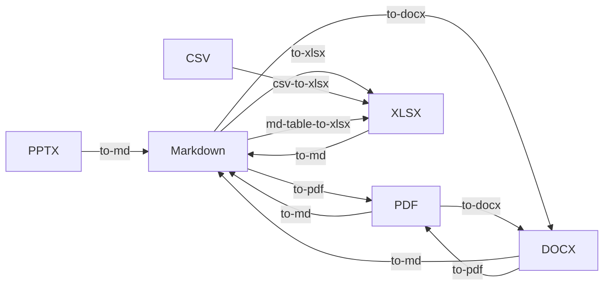

# QDocs

General-purpose document conversion, export, and revision management — a
standalone first-class Python package extracted from `qcli.qdocs`.



---

## Features

### Conversion
- **MD → PDF**: branded cover pages, revision tracking, landscape mode, page numbers
- **MD → DOCX**: cover pages, syntax highlighting, page breaks, metadata headers
- **MD → XLSX**: multi-sheet workbooks, currency formatting, locale-aware, auto-fit columns
- **CSV → XLSX**: direct import with type inference, header styling, and freeze-panes
- **MD Table → XLSX**: extract standalone GFM tables into multi-sheet workbooks
- **PDF → MD**: pdfplumber (local) or AWS Textract + Bedrock AI formatting
- **DOCX/XLSX/PPTX → MD**: office document extraction
- **DOCX → PDF, PDF → DOCX**: office format interop

### Advanced XLSX Features
- **Conditional Formatting**: Data bars, color scales, and rule-based cell styling
- **Data Validation**: Dropdown lists and numeric constraints for cells
- **Merged Ranges**: Support for multi-cell merged headers and data blocks
- **Named Ranges**: Register workbook-level named ranges for formulas
- **Cell Comments**: Persistent notes/annotations on individual cells

### Syntax Validation
- **CSV**: RFC 4180 compliance, delimiter detection, and shape consistency
- **MD Tables**: GFM syntax validation and column-count alignment
- **XLSX**: Integrity checks, sheet title validation, and empty sheet detection

### Diagrams
- Extract & render Mermaid blocks from Markdown
- Content-addressed caching — skip re-render when unchanged
- Export raw `.mmd` source files
- SVG/PNG output with configurable width/background

### Book Assembly
- Combine multiple Markdown files into a single PDF/DOCX
- Auto-generated Table of Contents
- Chapter export — each subdirectory becomes its own book

### Revision Management
- Auto-incrementing revision counter per document
- Content-hash change detection (SHA-256)
- DuckDB-persisted history with author, notes, timestamps
- Prune stale revision files

### Content Cache
- URN-based content addressing: `urn:intriq:qdocs:{kind}:{uuid5}`
- Sharded object storage with DuckDB metadata index
- Hit count tracking, TTL-based expiry
- Backend-swappable (local → S3, future)

### CLI
- Rich clypi-powered command tree with progress bars
- Batch processing with glob patterns
- Profile management (branding, logo, classification)
- ISMS export pipeline (versioned PDF/DOCX, TOML→MD, revision pruning)

---

## Install

```bash
uv add qdocs
# or
uv sync
```

## Quick Start

```bash
# Validate file syntax
qdocs validate --source data.csv
qdocs validate --source report.md --format md

# Convert CSV to XLSX
qdocs convert csv-to-xlsx --source log.csv --target data.xlsx

# Extract tables from MD
qdocs convert md-table-to-xlsx --source notes.md

# Start MCP server
qdocs mcp

# Convert a single file
qdocs convert to-pdf --source report.md
qdocs convert to-docx --source report.md --classification CONFIDENTIAL

# Batch convert a directory
qdocs export --source-dir ./docs --fmt pdf

# Assemble a book
qdocs export --source-dir ./docs --fmt pdf --book --book-title "Platform Docs"

# Render diagrams
qdocs diagrams generate --source architecture.md

# Convert PDF to Markdown (Textract + AI)
qdocs convert to-md --source scanned-report.pdf --provider textract
```

## Python API

```python
from qdocs import (
    convert_md_to_pdf,
    convert_md_to_docx,
    CoverPageConfig,
    DocumentClassification,
    QdocsSettings,
)

# Simple conversion
convert_md_to_pdf("report.md", "report.pdf")

# With branding
settings = QdocsSettings.load()
cover = CoverPageConfig(
    enabled=True,
    version_str="1.0",
    classification=DocumentClassification.CONFIDENTIAL,
)
convert_md_to_pdf("report.md", "report.pdf", cover=cover)

# Export service (batch, book, chapters)
from qdocs import ExportService, ProfileManager

svc = ExportService(settings)
results = await svc.export_directory(
    source_dir="./docs",
    output_dir="./out",
    fmt="pdf",
    cover=cover,
)
```

## Package Structure

```
src/qdocs/
├── __init__.py              # Public API surface
├── _local_db.py             # Self-contained DuckDB base (zero deps)
├── cli.py                   # CLI entry point (clypi)
├── config.py                # QdocsSettings
├── exceptions.py            # Typed error hierarchy
├── converters/              # 12 format converters + mermaid + highlighter
│   ├── md_to_pdf.py         #   MD → PDF (HTML→PDF via Playwright)
│   ├── md_to_docx.py        #   MD → DOCX (python-docx)
│   ├── md_to_xlsx.py        #   MD → XLSX (multi-sheet workbook)
│   ├── pdf_to_md.py         #   PDF → MD (pdfplumber)
│   ├── pdf_to_md_textract.py#   PDF → MD (AWS Textract + Bedrock AI)
│   ├── docx_to_md.py        #   DOCX → MD
│   ├── docx_to_pdf.py       #   DOCX → PDF
│   ├── pdf_to_docx.py       #   PDF → DOCX
│   ├── xlsx_to_md.py        #   XLSX → MD
│   ├── pptx_to_md.py        #   PPTX → MD
│   ├── mermaid.py           #   Mermaid block extraction & rendering
│   ├── highlighter.py       #   Syntax highlighting (Pygments)
│   └── utils.py             #   Hashing, file search, path helpers
├── models/                  # Pydantic v2 domain models
│   ├── profile.py           #   CoverPageConfig, ProfileConfig, Classification
│   ├── document.py          #   DocumentMeta, ConversionResult, DocumentFormat
│   └── revision.py          #   Revision, RevisionHistory
├── services/                # Application services
│   ├── exporter.py          #   ExportService (batch, book, chapter)
│   ├── profile_manager.py   #   ProfileManager (load, init, set-logo)
│   └── revision_manager.py  #   RevisionManager (bump, record, history, clear)
└── cache/                   # DuckDB persistence layer
    ├── store.py             #   QDocsDB (documents, diagrams, revisions)
    ├── content_cache.py     #   ContentCache (URN-addressed, sharded)
    └── history.py           #   QdocsHistoryDB (to-md conversion history)
```

## Documentation

| Document | Description |
|----------|-------------|
| [PRD](docs/PRD.md) | Product Requirements Document |
| [SPEC](docs/SPEC.md) | Technical Specification |
| [ARCHITECTURE](docs/ARCHITECTURE.md) | Architecture Decision Records |
| [CHANGELOG](CHANGELOG.md) | Version history |
| [RELEASE_NOTES](RELEASE_NOTES.md) | Per-release notes |
| [SECURITY](SECURITY.md) | Security audit findings |

## Design Principles

- **SoC**: Converters, services, models, and cache are separate layers
- **DDD**: Bounded contexts — Conversion, Document, Profile
- **DRY**: Single source of truth — `CoverPageConfig` used by all converters
- **SOLID**: Converters are pure functions; services compose them
- **YAGNI**: No S3 backend until needed; no gRPC until requested
- **KISS**: DuckDB for all persistence — no Redis, no PostgreSQL

## Requirements

- Python ≥3.14
- [mmdc](https://github.com/mermaid-js/mermaid-cli) (for diagram rendering): `npm install -g @mermaid-js/mermaid-cli`
- [Playwright](https://playwright.dev/) browsers (for PDF rendering): `playwright install chromium`
